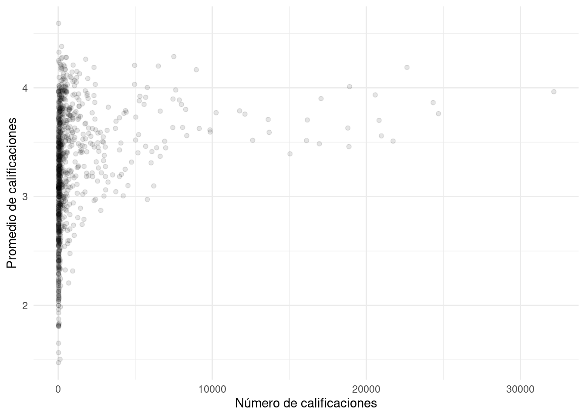
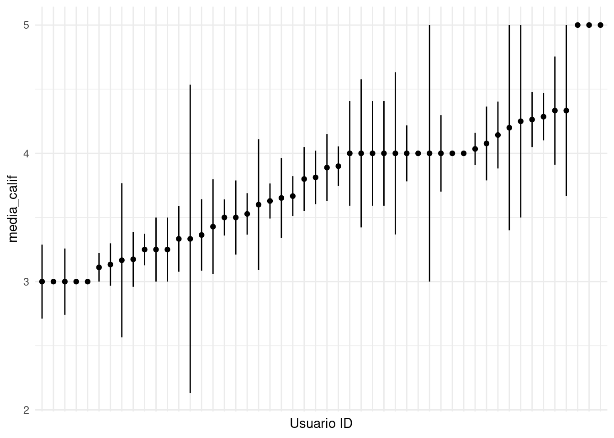
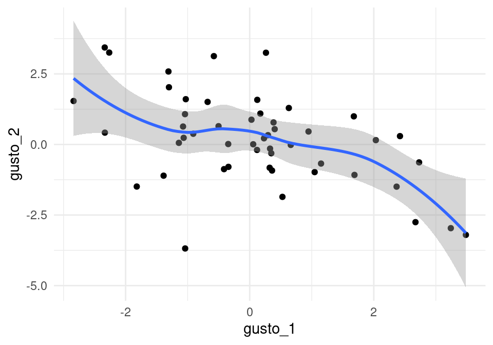
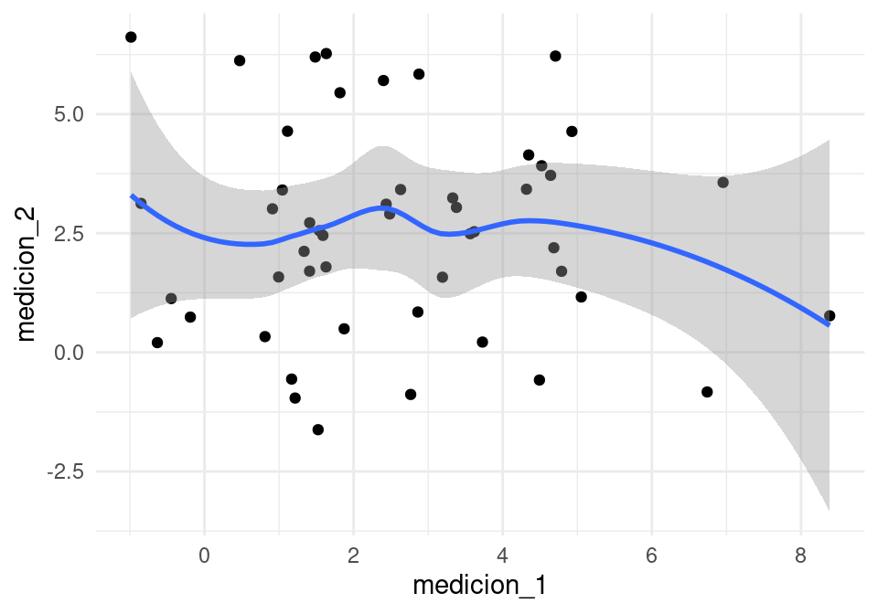
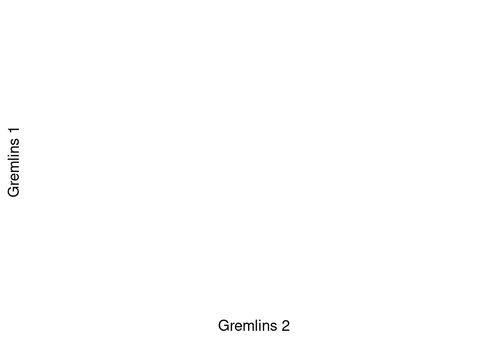
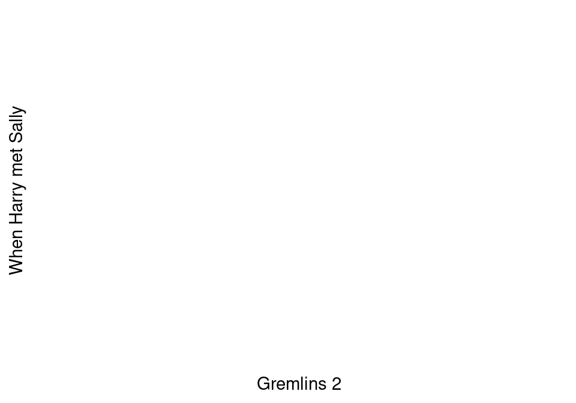

# Sistemas de recomendación y filtrado colaborativo


En esta sección discutiremos métodos que se pueden utilizar
para hacer recomendaciones de documentos, películas, artículos, etc.
a personas según sus intereses.

- **Problema**: predecir la respuesta de personas a estímulos a los que no han sido expuestos,
basados en respuesta a otros estímulos de esta y quizá otras personas similares.

Por ejemplo, si consideramos usuarios de Netflix: ¿qué tanto le puede gustar a X la película Y? Usuarios de Amazon: ¿qué tan probable es que compren Z artículo si se les ofrece?


## Enfoques de recomendación

Hay varios enfoques que podemos utilizar para atacar este problema:

- **Principalmente basados en contenido**:  En función de características de los estímulos, productos o películas (por ejemplo, género, actores, país de origen, año, etc.) intentamos predecir el gusto por el estímulo. En este enfoque, construimos variables derivadas del contenido de los artículos (por ejemplo: qué actores salen, año, etc. o en textos palabras que aparecen), e intentamos predecir el gusto a partir de esas características. 

Ejemplo: Si mu gustó *Twilight* entonces el sistema recomienda otros dramas+vampiros ("
por ejemplo "Entrevista con un vampiro").

- **Principalmente colaborativos**: utilizamos gustos o intereses de usuarios/artículos similares --- en el sentido de que les han gustado los mismos artículos/les gustaron a las mismas personas.

Ejemplo: Me gustó StarWars y Harry Potter, varios otros usuarios a los que también les gustaron estas dos películas también les gustó "Señor de los anillos", así que recomendamos "Señor de los Anillos". Entre estos métodos, veremos principalmente métodos basados en reducción de dimensionalidad o  **modelos de factores latentes**: encontrar factores latentes que describan usuarios y películas, y predecimos dependiendo de los niveles de factores latentes de personas y películas.


## Datos

Los datos utilizados para este tipo de sistemas son de dos
tipos:

- Ratings  *explícitos* dados por los usuarios (por ejemplo, Netflix mucho tiempo fue así: $1-5$ estrellas)

- Ratings *implícitos* que se derivan de la actividad de los usuarios (por ejemplo, vio la película completa, dio click en la descripción de un producto, etc.). 


### Ejemplo {-}

Consideramos evaluaciones en escala de gusto: por ejemplo $1-5$ estrellas, o $1$-me disgustó mucho, $5$-me gustó mucho, etc.

Podemos representar las evaluaciones como una matriz:


|   |SWars1 |SWars4 |SWars5 |HPotter1 |HPotter2 |Twilight |
|:--|:------|:------|:------|:--------|:--------|:--------|
|a  |3      |5      |5      |2        |-        |-        |
|b  |3      |-      |4      |-        |-        |-        |
|c  |-      |-      |-      |5        |4        |-        |
|d  |1      |-      |2      |-        |5        |4        |


Y lo que queremos hacer es predecir los valores faltantes de esta matriz, y seleccionar para cada usuario los artículos con predicción más alta, por ejemplo


|   |SWars1 |SWars4 |SWars5 |HPotter1 |HPotter2 |Twilight |
|:--|:------|:------|:------|:--------|:--------|:--------|
|a  |3      |5      |5      |2        |2.1      |3.3      |
|b  |3      |4      |4      |2.5      |3.1      |1        |
|c  |3.3    |1.8    |2.3    |5        |4        |5        |
|d  |1      |2.4    |2      |3.5      |5        |4        |

Podemos pensar en este problema como uno de **imputación de datos faltantes**. Las dificultades 
particulares de este problema son:

- Datos ralos: cada usuario sólo ha visto y calificado una proporción baja de películas, y hay películas con pocas vistas.
- Escalabilidad: el número de películas y usuarios es generalmente grande

Por estas razones, típicamente no es posible usar técnicas estadísticas de imputación de datos (como imputación estocástica basada en regresión)

- Usaremos mejor métodos más simples basados en similitud entre usuarios y películas y descomposición de matrices.

## Modelos de referencia y evaluación

Vamos a comenzar considerando modelos muy simples. El primero que se nos puede ocurrir es uno
de homogeneidad de gustos: para una persona $i$, nuestra predicción de su gusto por la película
$j$ es simplemente la media de la película $j$ sobre todos los usuarios que la han visto. 

Este sería un buen modelo si los gustos fueran muy parecidos sobre todos los usuarios. Esta sería una recomendación de "artículos populares".

Introducimos la siguente notación:

- $x_{ij}$ es la evaluación del usuario $i$ de la película $j$. Obsérvese que muchos de estos valores no son observados (no tenemos información de varias $x_{ij}$).
- $\hat{x}_{ij}$ es la predicción que hacemos de gusto del usuario $i$ por la película $j$


En nuestro primer modelo simple, nuestra predicción es simplemente
$$\hat{x}_{ij} = \hat{b}_j$$
donde 
$$\hat{b_j} = \frac{1}{N_j}\sum_{s} x_{sj},$$
y este promedio es sobre los $N_j$ usuarios que vieron (y calificaron) la película $j$.

¿Cómo evaluamos nuestras predicciones?

### Evaluación de predicciones

Usamos muestras de entrenamiento y validación. Como en el concurso de Netflix,
utilizaremos la raíz del error cuadrático medio:

$$RECM =\left ( \frac{1}{T} \sum_{(i,j) \, observada} (x_{ij}-\hat{x}_{ij})^2 \right)^{\frac{1}{2}}$$

aunque también podríamos utilizar la desviación absoluta media:

$$DAM =\frac{1}{T} \sum_{(i,j) \, observada} |x_{ij}-\hat{x}_{ij}|$$

- Nótese que estas dos cantidades se evaluán sólo sobre los pares $(i,j)$ para los
que tengamos una observación $x_{ij}$.

**Observaciones**:

- Generalmente evaluamos sobre un conjunto de validación separado del conjunto
de entrenamiento.

- Escogemos una muestra de películas, una muestra de usuarios, y ponemos
en validación el conjunto de calificaciones de esos usuarios para esas películas. 

- Para hacer un conjunto de prueba, idealmente los datos deben ser de películas
que hayan sido observadas por los usuarios en el futuro (después del periodo de los
datos de entrenamiento).

- Nótese que no seleccionamos *todas* las evaluaciones de un usuario, ni *todas* las
evaluaciones de una película. Con estas estrategias, veríamos qué pasa con nuestro
modelo cuando tenemos una película que no se ha visto o un usuario nuevo.
Lo que queremos ententer es cómo se desempeña nuestro sistema
cuando tenemos cierta información de usuarios y de películas.


### Ejemplo: datos de Netflix {-}


Los datos del concurso de Netflix originalmente vienen en archivos de texto, un archivo por película.

The movie rating files contain over $100$ million ratings from $480$ thousand
randomly-chosen, anonymous Netflix customers over $17$ thousand movie titles.  The
data were collected between October, $1998$ and December, $2005$ and reflect the
distribution of all ratings received during this period.  The ratings are on a
scale from $1$ to $5$ (integral) stars. To protect customer privacy, each customer
id has been replaced with a randomly-assigned id.  The date of each rating and
the title and year of release for each movie id are also provided.

The file "training_set.tar" is a tar of a directory containing $17770$ files, one
per movie.  The first line of each file contains the movie id followed by a
colon.  Each subsequent line in the file corresponds to a rating from a customer
and its date in the following format:

CustomerID,Rating,Date

- MovieIDs range from $1$ to $17770$ sequentially.
- CustomerIDs range from $1$ to $2649429$, with gaps. There are $480189$ users.
- Ratings are on a five star (integral) scale from $1$ to $5$.
- Dates have the format YYYY-MM-DD.

---

En primer lugar haremos un análisis exploratorio de los datos para entender algunas
de sus características, ajustamos el modelo simple de gustos homogéneos (la predicción es el
promedio de calificaciones de cada película), y lo evaluamos.

Comenzamos por cargar los datos:


```r
library(tidyverse)
theme_set(theme_minimal())
cb_palette <- c("#000000", "#E69F00", "#56B4E9", "#009E73", "#F0E442", "#0072B2", "#D55E00", "#CC79A7")
```


```r
# url <- "https://s3.amazonaws.com/ma-netflix/dat_muestra_nflix.csv"
pelis_nombres <- read_csv('../datos/netflix/movies_title_fix.csv', col_names = FALSE, na = c("", "NA", "NULL"))
```

```
## Rows: 17770 Columns: 3
```

```
## ── Column specification ────────────────────────────────────────────────────────
## Delimiter: ","
## chr (1): X3
## dbl (2): X1, X2
```

```
## 
## ℹ Use `spec()` to retrieve the full column specification for this data.
## ℹ Specify the column types or set `show_col_types = FALSE` to quiet this message.
```

```r
names(pelis_nombres) <- c('peli_id','año','nombre')
dat_netflix <- read_csv( "../datos/netflix/dat_muestra_nflix.csv", progress = FALSE) |> 
    select(-usuario_id_orig) |> 
    mutate(usuario_id = as.integer(as.factor(usuario_id)))
```

```
## Rows: 1048575 Columns: 5
```

```
## ── Column specification ────────────────────────────────────────────────────────
## Delimiter: ","
## chr (1): fecha
## dbl (4): peli_id, usuario_id_orig, calif, usuario_id
```

```
## 
## ℹ Use `spec()` to retrieve the full column specification for this data.
## ℹ Specify the column types or set `show_col_types = FALSE` to quiet this message.
```

```r
head(dat_netflix)
```

```
## # A tibble: 6 × 4
##   peli_id calif fecha      usuario_id
##     <dbl> <dbl> <chr>           <int>
## 1       1     3 14/04/2004          1
## 2       1     3 28/12/2004          2
## 3       1     4 06/04/2004          3
## 4       1     4 07/03/2004          4
## 5       1     4 29/03/2004          5
## 6       1     2 11/07/2004          6
```

```r
dat_netflix |> tally()
```

```
## # A tibble: 1 × 1
##         n
##     <int>
## 1 1048575
```


Y ahora calculamos las medias de cada película. 


```r
medias_pelis <- dat_netflix |> group_by(peli_id) |> 
    summarise(media_peli = mean(calif), num_calif_peli = n()) 
medias_pelis <- left_join(medias_pelis, pelis_nombres)
```

```
## Joining, by = "peli_id"
```


```r
arrange(medias_pelis, desc(media_peli)) |> 
  top_n(200, media_peli) |> 
  mutate(media_peli = round(media_peli, 2)) |>
  DT::datatable()
```

```{=html}
<div id="htmlwidget-9d7e9b86e4755c7cb13f" style="width:100%;height:auto;" class="datatables html-widget"></div>
<script type="application/json" data-for="htmlwidget-9d7e9b86e4755c7cb13f">{"x":{"filter":"none","vertical":false,"data":[["1","2","3","4","5","6","7","8","9","10","11","12","13","14","15","16","17","18","19","20","21","22","23","24","25","26","27","28","29","30","31","32","33","34","35","36","37","38","39","40","41","42","43","44","45","46","47","48","49","50","51","52","53","54","55","56","57","58","59","60","61","62","63","64","65","66","67","68","69","70","71","72","73","74","75","76","77","78","79","80","81","82","83","84","85","86","87","88","89","90","91","92","93","94","95","96","97","98","99","100","101","102","103","104","105","106","107","108","109","110","111","112","113","114","115","116","117","118","119","120","121","122","123","124","125","126","127","128","129","130","131","132","133","134","135","136","137","138","139","140","141","142","143","144","145","146","147","148","149","150","151","152","153","154","155","156","157","158","159","160","161","162","163","164","165","166","167","168","169","170","171","172","173","174","175","176","177","178","179","180","181","182","183","184","185","186","187","188","189","190","191","192","193","194","195","196","197","198","199","200"],[13,724,710,270,316,325,774,712,752,244,85,935,560,359,223,839,476,872,908,886,663,451,68,241,1006,577,722,209,33,634,76,595,822,933,825,345,167,430,32,417,463,253,106,471,215,251,799,473,996,889,907,37,498,762,575,943,175,657,494,504,555,699,805,421,871,443,462,520,25,91,880,952,395,621,242,98,206,579,690,753,778,432,571,837,561,159,703,895,454,152,992,240,619,861,135,191,165,5,371,292,645,900,442,780,410,824,709,257,138,804,263,113,760,798,479,585,199,576,397,668,477,963,519,88,229,851,441,899,97,865,457,939,587,918,730,143,720,161,539,893,180,673,982,46,734,419,455,501,616,1008,221,840,400,646,777,103,409,384,342,642,239,901,79,304,28,1,333,436,971,518,487,617,857,660,764,482,339,789,73,609,268,958,224,94,269,62,406,18,52,747,516,30,990,71,891,788,350,281,682,832],[4.59,4.38,4.33,4.29,4.28,4.28,4.28,4.27,4.26,4.25,4.23,4.21,4.21,4.21,4.21,4.2,4.2,4.2,4.19,4.19,4.19,4.18,4.17,4.17,4.17,4.17,4.15,4.14,4.13,4.13,4.12,4.11,4.1,4.1,4.09,4.09,4.08,4.08,4.08,4.08,4.07,4.07,4.07,4.06,4.05,4.04,4.03,4.03,4.03,4.03,4.02,4.02,4.02,4.02,4.02,4.01,4.01,4,4,4,4,4,4,3.99,3.98,3.98,3.98,3.98,3.98,3.97,3.97,3.97,3.97,3.97,3.97,3.97,3.97,3.97,3.97,3.97,3.97,3.96,3.96,3.96,3.96,3.96,3.96,3.96,3.95,3.95,3.94,3.94,3.94,3.94,3.94,3.93,3.93,3.93,3.93,3.93,3.93,3.93,3.92,3.92,3.92,3.91,3.91,3.91,3.91,3.91,3.9,3.9,3.9,3.9,3.9,3.9,3.9,3.89,3.89,3.89,3.89,3.89,3.89,3.88,3.88,3.88,3.88,3.88,3.87,3.87,3.86,3.86,3.86,3.85,3.85,3.85,3.85,3.85,3.84,3.84,3.84,3.83,3.83,3.83,3.83,3.82,3.82,3.82,3.82,3.82,3.82,3.82,3.82,3.81,3.81,3.81,3.81,3.81,3.81,3.81,3.81,3.81,3.8,3.8,3.8,3.8,3.8,3.8,3.8,3.79,3.79,3.79,3.79,3.79,3.79,3.79,3.79,3.79,3.78,3.78,3.78,3.78,3.78,3.78,3.78,3.78,3.77,3.77,3.77,3.77,3.77,3.76,3.76,3.76,3.76,3.76,3.76,3.76,3.75,3.75],[27,221,49,7504,517,244,514,198,1785,24,60,154,337,973,4960,205,421,6498,2325,22639,162,243,454,8964,181,447,1216,901,1388,341,561,323,769,63,1201,845,1918,333,404,303,485,1052,196,955,1179,249,219,4957,2405,596,1058,53,60,490,460,361,18912,421,5783,509,210,72,65,187,310,7626,174,41,241,116,347,523,409,1760,456,32,254,460,183,29,29,562,32172,275,528,25,47,532,363,1876,1323,1064,63,125,78,20577,957,223,442,114,1872,2320,5306,75,209,210,69,5675,1222,131,197,288,1939,17062,350,408,7452,138,162,1345,471,7862,71,208,138,5261,80,32,2373,52,24340,29,119,1563,932,7998,5574,130,31,191,523,259,346,1369,1348,130,174,3255,28,207,39,741,774,836,137,42,94,318,276,255,443,139,693,746,8273,105,85,723,704,468,68,174,307,4368,123,11775,117,6626,130,134,1153,68,231,86,4422,58,10249,2203,1075,26,4266,24683,625,303,58,12119,246,674,1013,753],[2003,1992,1993,2001,1999,2004,2003,1998,1993,2004,2005,2003,2003,2003,2003,1945,2004,1954,1981,2004,1999,1993,2004,1959,1996,1961,2003,1996,2000,1989,1952,2001,2001,2005,1983,1998,2004,2002,2004,1986,1962,1935,2004,1931,1998,2000,2003,1997,1961,2004,1930,1973,1989,2004,1994,2004,1992,1996,1983,1964,1996,2004,1968,2003,1984,2002,2005,2004,1997,2005,1994,1940,1935,1997,1995,1965,2004,1973,2004,1964,2003,1996,1999,1972,1963,1971,2004,1975,1995,1995,1972,1942,1980,2003,1998,2003,1982,2004,1966,2005,2004,1994,1988,2003,1998,1977,1998,1973,1995,1944,2001,2000,2005,1975,1988,1995,1978,2000,1946,2004,1990,1951,1979,1998,2003,1990,1968,2003,2002,2005,2004,2003,1983,1964,1988,1997,1989,1939,1987,2003,2002,1999,2001,1964,1992,2005,1999,1975,1983,1996,2005,1941,1970,1987,1944,1976,1966,1986,2001,1990,2004,1950,1956,1997,2002,2003,2003,1985,2002,1969,1968,2004,1963,2000,1983,2002,1968,1991,1954,2002,1980,2003,1999,2000,1989,1991,2005,1994,2002,1996,2001,2003,1941,1995,2003,1994,1993,1993,1998,2003],["Lord of the Rings: The Return of the King: Extended Edition: Bonus Material","Yu Yu Hakusho","Inspector Morse 9: The Last Enemy","Sex and the City: Season 4","Futurama: Monster Robot Maniac Fun Collection","Ghosts of Rwanda: Frontline","Foyle's War: Set 2","Homicide: Life on the Street: Season 7","Star Trek: The Next Generation: Season 7","Stellvia","Elfen Lied","Read Or Die","Star Trek: Enterprise: Season 3","Absolutely Fabulous: Series 5","Chappelle's Show: Season 1","The Thin Man Goes Home","VeggieTales Classics: Where's God When I'm Scared?","Seven Samurai","Sense and Sensibility","Ray","La Femme Nikita: Season 3","Batman the Animated Series: Vol. 3","Invader Zim","North by Northwest","Inspector Morse 30: The Daughters of Cain","The Twilight Zone: Vol. 36","The Wire: Season 1","Star Trek: Deep Space Nine: Season 5","Aqua Teen Hunger Force: Vol. 1","Christmas with The Simpsons","I Love Lucy: Season 2","Monarch of the Glen: Series 2","Star Trek: Enterprise: Season 1","Backyardigans: It's Great to Be a Ghost","Bill Cosby: Himself","Star Trek: Voyager: Season 5","The Chorus","Chobits","ABC Primetime: Mel Gibson's The Passion of the Christ","Transformers: Season 3: Part 1","The Twilight Zone: Vol. 12","A Night at the Opera","Stevie Ray Vaughan and Double Trouble: Live at Montreux 1982 &amp; 1985","City Lights","That '70s Show: Season 1","Midsomer Murders: Strangler's Wood","Teen Titans: Season 1","Princess Mononoke","Yojimbo","Reno 911: Season 2","Animal Crackers","Zatoichi's Conspiracy","Glory: Bonus Material","End of the Century: The Story of the Ramones","Highlander: Season 4","Dave Chappelle: For What It's Worth","Reservoir Dogs","Highlander: Season 5","Monty Python's The Meaning of Life: Special Edition","The Twilight Zone: Vol. 27","Cadfael: A Morbid Taste for Bones","Mahoromatic: Automatic Maiden: Summer Special","Dark Shadows: Vol. 11","Agatha Christie's Poirot: Sad Cypress","The Jewel in the Crown","Rabbit-Proof Fence","Classic Cartoon Favorites: Starring Donald","E's Otherwise","Inspector Morse 31: Death Is Now My Neighbour","WWE: Royal Rumble 2005","Sharpe 4: Sharpe's Enemy","My Favorite Wife","Captain Blood","Armageddon","Neon Genesis Evangelion: The End of Evangelion","The Battle of Algiers: Bonus Material","Unconstitutional: The War on Our Civil Liberties","The Autobiography of Miss Jane Pittman","Baby Einstein: Baby Da Vinci","Mary Poppins: Bonus Material","A Touch of Frost: Seasons 7 &amp; 8","Les Miserables in Concert","American Beauty","All in the Family: Season 3","High and Low","Gentlemen of Fortune","Japan: Memoirs of a Secret Empire","Dersu Uzala","Xena: Warrior Princess: Season 3","A Little Princess","The Cowboys","Woman of the Year","Doctor Who: The Leisure Hive","Rush: Rush in Rio","GTO: Great Teacher Onizuka: Set 2","X2: X-Men United","Richard Pryor: Live on the Sunset Strip","The Rise and Fall of ECW","The Trouble with Angels","Saturday Night Live: The Best of Gilda Radner","Dear Frankie","Eat Drink Man Woman","Mississippi Burning","Churchill","Frank Lloyd Wright","A Piece of the Action","Africans in America: America's Journey Through Slavery","Charlotte's Web","Star Trek: Voyager: Season 1","Sherlock Holmes: The Scarlet Claw","Dragon Ball: Tournament Saga","Bruce Lee: A Warrior's Journey","Pooh's Heffalump Movie","Jaws","George Carlin: What Am I Doing in New Jersey?","My Family","The Deer Hunter","Popular: Season 2","A Night in Casablanca","Saturday Night Live: The Best of Will Ferrell 2","George Carlin: Personal Favorites","A Streetcar Named Desire","From Mao to Mozart: Isaac Stern in China","Record of Lodoss War: Chronicles of the Heroic Knight","Peter Gabriel: Growing Up Live","Back to the Future Part III","Dark Shadows: Vol. 9","Out of Ireland: The Hit Songs and Artists of Irish Music","Mostly Martha","Elvis by the Presleys","Kill Bill: Vol. 2","Midsomer Murders: A Tale of Two Hamlets","The Scarlet and the Black","A Hard Day's Night: Collector's Series","Bagdad Cafe","The Game","Roger &amp; Me","Ninotchka","Rumpole of the Bailey: Series 4","Blue's Clues: Classic Clues","Scratch","Fight Club: Bonus Material","Dil Chahta Hai","Rudolph the Red-Nosed Reindeer","Indochine","George Lopez: Why You Crying?","Cardcaptor Sakura: The Movie","Three Days of the Condor","SCTV Network 90: Vol. 4","Ken Burns' The West","Voyage to the Planets and Beyond","The Lady Eve","Rio Lobo","Matewan","Sherlock Holmes and the Spider Woman","Sanford and Son: Season 6","Godzilla vs. The Sea Monster","Crossroads","Noir","Mystery Science Theater 3000: The Hellcats","Winnie the Pooh: Springtime with Roo","Diary of a Country Priest","The Killing","King of the Hill: Season 1","Lilo and Stitch","Dinosaur Planet","Mail Call: The Best of Season 2","Girls Just Want to Have Fun","Unprecedented: The 2000 Presidential Election","The Prime of Miss Jean Brodie","Doctor Who: Lost in Time: The Patrick Troughton Years","UFC: Ultimate Fighting Championship: Ultimate Knockouts 3","The Three Stooges Go Around the World in a Daze","Saving Grace","Scarface: 20th Anniversary Edition: Bonus Material","Frida","Rolling Stones: Rock and Roll Circus","Boyz N the Hood","Davy Crockett: 50th Anniversary Double Feature","Jimmy Neutron: Attack of the Twonkies","The Final Countdown","World Cup Soccer Highlights: 1966-1974","Midsomer Murders: Blood Will Out","G3: Live in Concert","Parenthood","Ken Burns' America: Empire of the Air","Hostage","Immortal Beloved","The Weather Underground","Saber Marionette J","Monsoon Wedding","Something's Gotta Give","Meet John Doe","Maya Lin: A Strong Clear Vision","Zakk Wylde's Black Label Society: Boozed Broozed &amp; Broken-Boned","Clerks","Dr. Quinn Medicine Woman: Season 3","The Legend","The Mighty","Tupac: Resurrection"]],"container":"<table class=\"display\">\n  <thead>\n    <tr>\n      <th> <\/th>\n      <th>peli_id<\/th>\n      <th>media_peli<\/th>\n      <th>num_calif_peli<\/th>\n      <th>año<\/th>\n      <th>nombre<\/th>\n    <\/tr>\n  <\/thead>\n<\/table>","options":{"columnDefs":[{"className":"dt-right","targets":[1,2,3,4]},{"orderable":false,"targets":0}],"order":[],"autoWidth":false,"orderClasses":false}},"evals":[],"jsHooks":[]}</script>
```

Nótese que varias de las películas con mejor promedio tienen muy pocas evaluaciones. Podemos
examinar más detalladamente graficando número de evaluaciones vs promedio:


```r
ggplot(medias_pelis, aes(x=num_calif_peli, y=media_peli)) + 
  geom_point(alpha = 0.1) + xlab("Número de calificaciones") + 
  ylab("Promedio de calificaciones") 
```




Y vemos que hay más variabilidad en los promedios cuando hay menos evaluaciones, como
es de esperarse. ¿Puedes ver algún problema que tendremos que enfrentar con el modelo simple? 


Si filtramos por número de calificaciones (al menos $500$ por ejemplo), 
estas son las películas mejor calificadas (la mayoría conocidas y populares):


```r
arrange(medias_pelis, desc(media_peli)) |> 
  filter(num_calif_peli > 500) |>
  top_n(200, media_peli) |> 
  mutate(media_peli = round(media_peli, 2)) |>
  DT::datatable()
```

```{=html}
<div id="htmlwidget-1d1cebbe5975705c9758" style="width:100%;height:auto;" class="datatables html-widget"></div>
<script type="application/json" data-for="htmlwidget-1d1cebbe5975705c9758">{"x":{"filter":"none","vertical":false,"data":[["1","2","3","4","5","6","7","8","9","10","11","12","13","14","15","16","17","18","19","20","21","22","23","24","25","26","27","28","29","30","31","32","33","34","35","36","37","38","39","40","41","42","43","44","45","46","47","48","49","50","51","52","53","54","55","56","57","58","59","60","61","62","63","64","65","66","67","68","69","70","71","72","73","74","75","76","77","78","79","80","81","82","83","84","85","86","87","88","89","90","91","92","93","94","95","96","97","98","99","100","101","102","103","104","105","106","107","108","109","110","111","112","113","114","115","116","117","118","119","120","121","122","123","124","125","126","127","128","129","130","131","132","133","134","135","136","137","138","139","140","141","142","143","144","145","146","147","148","149","150","151","152","153","154","155","156","157","158","159","160","161","162","163","164","165","166","167","168","169","170","171","172","173","174","175","176","177","178","179","180","181","182","183","184","185","186","187","188","189","190","191","192","193","194","195","196","197","198","199","200"],[270,316,774,752,359,223,872,908,886,241,722,209,33,76,822,825,345,167,253,471,215,473,996,889,907,175,494,504,443,952,621,432,571,561,895,152,992,240,191,165,645,900,442,257,138,760,798,199,668,963,851,97,457,918,730,143,720,180,46,734,501,840,400,646,79,304,28,436,971,660,482,789,268,269,406,18,52,516,30,990,788,281,682,832,748,48,486,677,405,937,420,83,283,425,843,171,312,262,104,299,133,313,964,456,940,344,44,631,57,705,361,807,985,725,488,385,58,658,275,662,331,248,711,638,401,290,700,305,329,883,629,166,445,311,358,334,607,433,809,424,817,961,474,833,670,489,746,468,431,357,986,758,692,681,636,615,763,862,599,197,535,563,569,459,517,330,156,483,213,859,818,256,896,550,118,696,381,348,413,689,733,674,201,953,252,408,708,422,189,273,285,393,652,148,295,1001,954,551,524,554],[4.29,4.28,4.28,4.26,4.21,4.21,4.2,4.19,4.19,4.17,4.15,4.14,4.13,4.12,4.1,4.09,4.09,4.08,4.07,4.06,4.05,4.03,4.03,4.03,4.02,4.01,4,4,3.98,3.97,3.97,3.96,3.96,3.96,3.96,3.95,3.94,3.94,3.93,3.93,3.93,3.93,3.92,3.91,3.91,3.9,3.9,3.9,3.89,3.89,3.88,3.87,3.86,3.85,3.85,3.85,3.85,3.84,3.83,3.83,3.82,3.82,3.82,3.81,3.8,3.8,3.8,3.8,3.8,3.79,3.79,3.79,3.78,3.78,3.77,3.77,3.77,3.77,3.76,3.76,3.76,3.76,3.75,3.75,3.75,3.74,3.74,3.74,3.74,3.73,3.73,3.72,3.72,3.72,3.71,3.71,3.71,3.71,3.71,3.7,3.7,3.7,3.7,3.7,3.69,3.68,3.67,3.67,3.64,3.64,3.63,3.63,3.63,3.63,3.63,3.63,3.63,3.63,3.62,3.61,3.61,3.61,3.61,3.61,3.6,3.59,3.59,3.59,3.59,3.59,3.58,3.58,3.57,3.57,3.56,3.56,3.56,3.55,3.55,3.55,3.54,3.54,3.54,3.53,3.53,3.52,3.52,3.52,3.52,3.51,3.51,3.51,3.51,3.51,3.51,3.5,3.49,3.49,3.49,3.49,3.49,3.48,3.47,3.47,3.47,3.46,3.46,3.46,3.46,3.46,3.46,3.45,3.45,3.45,3.43,3.43,3.42,3.42,3.41,3.41,3.41,3.41,3.41,3.41,3.4,3.4,3.39,3.39,3.38,3.37,3.33,3.32,3.32,3.32,3.31,3.28,3.28,3.28,3.27,3.27],[7504,517,514,1785,973,4960,6498,2325,22639,8964,1216,901,1388,561,769,1201,845,1918,1052,955,1179,4957,2405,596,1058,18912,5783,509,7626,523,1760,562,32172,528,532,1876,1323,1064,20577,957,1872,2320,5306,5675,1222,1939,17062,7452,1345,7862,5261,2373,24340,1563,932,7998,5574,523,1369,1348,3255,741,774,836,693,746,8273,723,704,4368,11775,6626,1153,4422,10249,2203,1075,4266,24683,625,12119,674,1013,753,771,739,819,1330,1442,5033,910,3978,1335,971,2385,1285,13633,939,758,16171,505,20825,605,519,3752,553,1786,1736,763,8075,7437,639,18801,1065,635,1972,3713,9156,2225,2431,9853,1233,3177,873,657,9868,952,2734,13693,933,2578,1979,1622,5214,610,8347,20978,2117,839,2929,1070,524,671,1775,1601,1032,5023,12620,696,16118,707,21738,6912,894,2881,2940,2571,4068,2098,16949,1307,2242,886,1559,1424,5675,1724,18872,766,2342,3056,2589,6390,6975,3980,1519,1429,2639,6082,1853,542,1553,603,1464,5175,571,15047,1139,2996,6619,2945,2470,1095,4760,6032,1305,1682,3065,1297,1235],[2001,1999,2003,1993,2003,2003,1954,1981,2004,1959,2003,1996,2000,1952,2001,1983,1998,2004,1935,1931,1998,1997,1961,2004,1930,1992,1983,1964,2002,1940,1997,1996,1999,1963,1975,1995,1972,1942,2003,1982,2004,1994,1988,1973,1995,2005,1975,1978,2004,1951,1990,2002,2004,1964,1988,1997,1989,2002,1964,1992,1975,1941,1970,1987,1956,1997,2002,1985,2002,2000,2002,1991,1980,1989,2005,1994,2002,2001,2003,1941,1994,1993,1998,2003,2002,2001,1959,2001,1987,1998,1999,1983,1996,2000,1999,1957,2000,1974,1965,2001,2003,2000,2001,1996,1997,1967,1996,2005,1995,1989,2004,1959,1999,2004,2001,2002,1996,1991,2002,1995,1997,2001,1994,1985,1989,2004,1997,1996,1999,1992,1984,1980,1996,1994,1979,2005,1994,1993,2002,1998,1980,1957,1998,1996,2002,1998,2001,2003,2002,2003,2002,2004,1992,1986,1980,1999,1972,2002,1989,2004,1960,2001,1979,1996,2001,1998,1992,2001,2001,1982,1976,2000,1995,1995,1985,1996,1991,1988,2002,1998,1988,1988,2001,1966,2002,1990,2000,1964,1982,2004,1997,1998,1996,2001,1995,2001,2003,1994,1999,1972],["Sex and the City: Season 4","Futurama: Monster Robot Maniac Fun Collection","Foyle's War: Set 2","Star Trek: The Next Generation: Season 7","Absolutely Fabulous: Series 5","Chappelle's Show: Season 1","Seven Samurai","Sense and Sensibility","Ray","North by Northwest","The Wire: Season 1","Star Trek: Deep Space Nine: Season 5","Aqua Teen Hunger Force: Vol. 1","I Love Lucy: Season 2","Star Trek: Enterprise: Season 1","Bill Cosby: Himself","Star Trek: Voyager: Season 5","The Chorus","A Night at the Opera","City Lights","That '70s Show: Season 1","Princess Mononoke","Yojimbo","Reno 911: Season 2","Animal Crackers","Reservoir Dogs","Monty Python's The Meaning of Life: Special Edition","The Twilight Zone: Vol. 27","Rabbit-Proof Fence","My Favorite Wife","Armageddon","Les Miserables in Concert","American Beauty","High and Low","Dersu Uzala","A Little Princess","The Cowboys","Woman of the Year","X2: X-Men United","Richard Pryor: Live on the Sunset Strip","Dear Frankie","Eat Drink Man Woman","Mississippi Burning","Charlotte's Web","Star Trek: Voyager: Season 1","Pooh's Heffalump Movie","Jaws","The Deer Hunter","Saturday Night Live: The Best of Will Ferrell 2","A Streetcar Named Desire","Back to the Future Part III","Mostly Martha","Kill Bill: Vol. 2","A Hard Day's Night: Collector's Series","Bagdad Cafe","The Game","Roger &amp; Me","Scratch","Rudolph the Red-Nosed Reindeer","Indochine","Three Days of the Condor","The Lady Eve","Rio Lobo","Matewan","The Killing","King of the Hill: Season 1","Lilo and Stitch","Girls Just Want to Have Fun","Unprecedented: The 2000 Presidential Election","Saving Grace","Frida","Boyz N the Hood","The Final Countdown","Parenthood","Hostage","Immortal Beloved","The Weather Underground","Monsoon Wedding","Something's Gotta Give","Meet John Doe","Clerks","The Legend","The Mighty","Tupac: Resurrection","I Can Do Bad All By Myself","Justice League","Journey to the Center of the Earth","In the Mood for Love","Wings of Desire","Fallen","Saturday Night Live: The Best of Dana Carvey","Silkwood","If These Walls Could Talk","The 10th Kingdom","Mansfield Park","Funny Face","High Fidelity","Herbie Rides Again","The Great Race","Bridget Jones's Diary","Viva La Bam: Season 1","Pay It Forward","The Tick: The Entire Series","Emma (Miniseries)","Hercules","The Taming of the Shrew","Spitfire Grill","Unleashed","Richard III","Major League","The Phantom of the Opera: Special Edition","The Mouse That Roared","The Mummy","Woman Thou Art Loosed","His Secret Life","The Santa Clause 2","Dragonheart","Robin Hood: Prince of Thieves","Evelyn","Rob Roy","Chasing Amy","Michael Moore's The Awful Truth: Season 2","Dolores Claiborne","The Last Dragon","Halloween 5: The Revenge of Michael Myers","Harold and Kumar Go to White Castle","Todd McFarlane's Spawn","Jack","Dogma","Deep Cover","Firestarter","Fame","Michael Collins","Ed Wood","The Onion Field","The Pacifier","Speed","Untamed Heart","Left Behind II: Tribulation Force","Happiness","My Bodyguard","Love in the Afternoon","Legend of 1900","White Squall","He Loves Me He Loves Me Not","Return to Paradise","Domestic Disturbance","The Matrix: Revolutions","Millennium Actress","House of Sand and Fog","The Trip","Mean Girls","The Hand that Rocks the Cradle","Police Academy 3: Back in Training","Stir Crazy","An Ideal Husband","The Poseidon Adventure","Tuck Everlasting","Sea of Love","Taking Lives","The Alamo","Jimmy Neutron: Boy Genius","The In-Laws","Basquiat","Two Can Play That Game","Wild Things","Husbands and Wives","Rush Hour 2","Dinner Rush","Creepshow","Logan's Run","Ghost Dog: The Way of the Samurai","Dangerous Minds","First Knight","Rambo: First Blood Part II","Last Man Standing","Out for Justice","The Last Temptation of Christ","Igby Goes Down","One True Thing","Dead Ringers","Hellbound: Hellraiser II","Home Movie","Fahrenheit 451","Stuart Little 2","Nightbreed","The Perfect Storm","The Unsinkable Molly Brown","Airplane II: The Sequel","Taxi","The Devil's Own","The Replacement Killers","Marvin's Room","Sweet November","Ace Ventura: When Nature Calls","Blow Dry","I Capture the Castle","The Santa Clause","Mumford","Solaris"]],"container":"<table class=\"display\">\n  <thead>\n    <tr>\n      <th> <\/th>\n      <th>peli_id<\/th>\n      <th>media_peli<\/th>\n      <th>num_calif_peli<\/th>\n      <th>año<\/th>\n      <th>nombre<\/th>\n    <\/tr>\n  <\/thead>\n<\/table>","options":{"columnDefs":[{"className":"dt-right","targets":[1,2,3,4]},{"orderable":false,"targets":0}],"order":[],"autoWidth":false,"orderClasses":false}},"evals":[],"jsHooks":[]}</script>
```

Ahora seleccionamos nuestra muestra de entrenamiento y de validación. Seleccionamos una
muestra de usuarios y de películas:


```r
set.seed(28882)
usuarios <- dat_netflix |> select(usuario_id) |> distinct()
valida_usuarios <- usuarios |> sample_frac(0.2) 
peliculas <-  dat_netflix |> select(peli_id) |> distinct()
valida_pelis <- peliculas |> sample_frac(0.2)
```

Y separamos calificaciones de entrenamiento y validación:


```r
dat_valida <- dat_netflix |> 
  semi_join(valida_usuarios) |> 
  semi_join(valida_pelis) 
```

```
## Joining, by = "usuario_id"
```

```
## Joining, by = "peli_id"
```

```r
dat_entrena <- dat_netflix |> 
  anti_join(dat_valida)
```

```
## Joining, by = c("peli_id", "calif", "fecha", "usuario_id")
```

```r
n_valida <- dat_valida |> tally() |> pull(n)
n_entrena <- dat_entrena |> tally() |> pull(n)
sprintf("Entrenamiento: %1d, Validación: %2d, Total: %3d", n_entrena, 
        n_valida, n_entrena + n_valida)
```

```
## [1] "Entrenamiento: 1003095, Validación: 45480, Total: 1048575"
```

Ahora construimos predicciones con el modelo simple de arriba y evaluamos con validación:


```r
medias_pred <- dat_entrena |> group_by(peli_id) |>
  summarise(media_pred = mean(calif)) 
media_total_e <- dat_entrena |> ungroup() |> summarise(media = mean(calif)) |> pull(media)
dat_valida_pred <- dat_valida |> left_join(medias_pred |> collect()) 
head(dat_valida_pred)
```

```
## # A tibble: 6 × 5
##   peli_id calif fecha      usuario_id media_pred
##     <dbl> <dbl> <chr>           <int>      <dbl>
## 1       6     5 04/08/2004        785       3.05
## 2       6     4 10/04/2005        787       3.05
## 3       6     1 16/12/2005        790       3.05
## 4       6     4 20/02/2004        799       3.05
## 5       6     1 03/01/2005        815       3.05
## 6       6     5 01/11/2004        818       3.05
```

Nota que puede ser que algunas películas seleccionadas en validación no tengan evaluaciones en entrenamiento:

```r
table(is.na(dat_valida_pred$media_pred))
```

```
## 
## FALSE 
## 45480
```

```r
dat_valida_pred <- mutate(dat_valida_pred,
        media_pred = ifelse(is.na(media_pred), media_total_e, media_pred))
```

No sucede en este ejemplo, pero si sucediera podríamos usar el promedio general de las predicciones. Evaluamos ahora el error:


```r
recm <- function(calif, pred){
  sqrt(mean((calif - pred)^2))
}
error <- dat_valida_pred |> ungroup() |>
  summarise(error = mean((calif - media_pred)^2))
error
```

```
## # A tibble: 1 × 1
##   error
##   <dbl>
## 1  1.01
```

Este error está en las mismas unidades de las calificaciones (estrellas en este caso).

---

Antes de seguir con nuestra refinación del modelo, veremos algunas
observaciones acerca del uso de escala en análisis de datos:

Cuando tratamos con datos en escala encontramos un problema técnico que es el uso distinto
de la escala por los usuarios, muchas veces **independientemente de sus gustos**

Veamos los datos de Netflix para una muestra de usuarios:


```r
# muestra de usuarios
entrena_usu <- sample(unique(dat_entrena$usuario_id), 50)
muestra_graf <- filter(dat_entrena, usuario_id %in% entrena_usu)
# medias generales por usuario, ee de la media
muestra_res <- muestra_graf |> group_by(usuario_id) |>
  summarise(media_calif = mean(calif), 
            sd_calif = sd(calif)/sqrt(length(calif)))
muestra_res$usuario_id <- reorder(factor(muestra_res$usuario_id), muestra_res$media_calif)
ggplot(muestra_res, aes(x=factor(usuario_id), y = media_calif, 
        ymin = media_calif - sd_calif, ymax = media_calif + sd_calif)) + 
  geom_linerange() + geom_point() + xlab('Usuario ID') +
  theme(axis.text.x=element_blank())
```

```
## Warning: Removed 6 rows containing missing values (geom_segment).
```



Y notamos que hay unos usuarios que tienen promedios por encima de $4.5$, mientras que otros
califican por debajo de $3$ en promedio. Aunque esto puede deberse a las películas que han visto,
generalmente una componente de esta variabilidad se debe a cómo usa la escala cada usuario.

- En primer lugar, quizá uno podría pensar que un modelo base consiste de simplemente
predecir el promedio de una película sobre todos los usuarios que la calificaron (sin incluir el sesgo de cada persona). Esto no funciona bien porque típicamente hay distintos patrones
de uso de la escala de calificación, que depende más de forma de uso de escala que de la calidad de los items.

Hay personas que son:

- Barcos: $5$,$5$,$5$,$4$,$4$,$5$ 
- Estrictos: $2$,$3$,$3$,$1$,$1$,$2$
- No se compromete: $3$,$3$,$3$,$3$,$4$
- Discrimina: $5$,$4$,$5$,$1$,$2$,$4$

El estilo de uso de las escalas varía por persona.
Puede estar asociado a aspectos culturales (países
diferentes usan escalas de manera diferente), quizá también de personalidad,
y a la forma de obtener las evaluaciones (cara a cara, por teléfono, internet).

Lo primero que vamos a hacer para controlar esta fuente de variación es ajustar las predicciones
dependiendo del promedio de calificaciones de cada usuario.


### (Opcional) Efectos en análisis de heterogeneidad en uso de escala

 Muchas veces se considera que tratar como numéricos a calificaciones en escala no es muy apropiado, y que el análisis no tiene por qué funcionar pues en realidad las calificaciones están en una escala ordinal. Sin embargo,

- La razón principal por las que análisis de datos en escala es difícil *no es que usemos valores numéricos para los puntos de la escala*. Si esto fuera cierto, entonces por ejemplo, transformar una variable con logaritmo también sería "malo".

- La razón de la dificultad es que generalmente tenemos que lidiar con la  **heterogeneidad** en uso de la escala antes de poder obtener resultados útiles de nuestro análisis.


Supongamos que $X_1$ y $X_2$ son evaluaciones de dos películas. Por la discusión de arriba, podríamos escribir

$$X_1 = N +S_1,$$
$$X_2 = N + S_2,$$

donde $S_1$ y $S_2$ representan el gusto por la película, y $N$ representa el nivel general
de calificaciones. Consideramos que son variables aleatorias ($N$ varía con las personas, igual que $S_1$ y $S_2$).

Podemos calcular

$$Cov(X_1,X_2)$$

para estimar el grado de correlación de *gusto por las dos películas*, como si fueran variables numéricas. Esta no es muy buena idea, pero no tanto porque se 
trate de variables ordinales, sino porque en realidad quisiéramos calcular:

$$Cov(S_1, S_2)$$

que realmente representa la asociación entre el gusto por las dos películas. El problema
es que $S_1$ y $S_2$ son variables que no observamos.

¿Cómo se relacionan estas dos covarianzas?

$$Cov(X_1,X_2)=Cov(N,N) + Cov(S_1,S_2) + Cov(N, S_2)+Cov(N,S_1)$$

Tenemos que $Cov(N,N)=Var(N)=\sigma_N ^2$, y suponiendo que el gusto
no está correlacionado con los niveles generales 
de respuesta, $Cov(N_1, S_2)=0=Cov(N_2,S_1)$, de modo que

$$Cov(X_1,X_2)= Cov(S_1,S_2) + \sigma_N^2.$$


donde $\sigma_N^2$ no tiene qué ver nada con el gusto por las películas.

De forma que al usar estimaciones de $Cov(X_1,X_2)$ para estimar $Cov(S_1,S_2)$ puede
ser mala idea porque el sesgo hacia arriba puede ser alto, especialmente si la gente varía mucho
es un sus niveles generales de calificaciones (hay muy barcos y muy estrictos).

### Ejemplo {#ejemplo}

Los niveles generales de $50$ personas:


```r
set.seed(128)
n <- 50
niveles <- tibble(persona = 1:n, nivel = rnorm(n,2))
```
Ahora generamos los gustos (latentes) por dos artículos, que suponemos
con correlación negativa:


```r
x <- rnorm(n)
gustos <- tibble(persona=1:n, gusto_1 = x + rnorm(n),
                     gusto_2 = -x + rnorm(n))
head(gustos,3)
```

```
## # A tibble: 3 × 3
##   persona gusto_1 gusto_2
##     <int>   <dbl>   <dbl>
## 1       1   0.948   0.459
## 2       2   1.15   -0.676
## 3       3  -1.31    2.58
```

```r
cor(gustos[,2:3])
```

```
##            gusto_1    gusto_2
## gusto_1  1.0000000 -0.5136434
## gusto_2 -0.5136434  1.0000000
```

Estos dos items tienen gusto correlacionado negativamente:

```r
ggplot(gustos, aes(x=gusto_1, y=gusto_2)) + geom_point() +
    geom_smooth()
```

```
## `geom_smooth()` using method = 'loess' and formula 'y ~ x'
```




Pero las mediciones no están correlacionadas:

```r
medicion_1 <- niveles$nivel + gustos$gusto_1+rnorm(n,0.3)
medicion_2 <- niveles$nivel + gustos$gusto_2+rnorm(n,0.3)
mediciones <- tibble(persona = 1:n, medicion_1, medicion_2)
cor(mediciones[,2:3])
```

```
##             medicion_1  medicion_2
## medicion_1  1.00000000 -0.05825995
## medicion_2 -0.05825995  1.00000000
```


Así que aún cuando el gusto por $1$ y $2$  están correlacionadas negativamente, las 
**mediciones** de gusto no están correlacionadas.

```r
ggplot(mediciones, aes(x=medicion_1, y=medicion_2)) +
    geom_point() + geom_smooth()
```

```
## `geom_smooth()` using method = 'loess' and formula 'y ~ x'
```



**Observaciones**: Un modelado más cuidadoso de este tipo de datos requiere más trabajo. Pero para
el trabajo usual, generalmente intentamos controlar parte de la heterogeneidad
**centrando** las calificaciones por usuario. Es decir, a cada calificación
de una persona le restamos la media de sus calificaciones, que es una estimación
del nivel general $N$. Esta idea funciona si **$k$ no es muy chico**.


Si el número de calificaciones por persona ($k$) es chico,
entonces tenemos los siguientes problemas:

- El promedio de evaluaciones es una estimación ruidosa del nivel general.

- Podemos terminar con el problema opuesto: nótese que
si $X_1,\ldots, X_k$ son mediciones de gusto distintos items, entonces
$$Cov(X_1-\bar{X}, X_2-\bar{X})=Cov(S_1-\bar{S},S_2-\bar{S}),$$
$$=Cov(S_1,S_2)-Cov(S_1,\bar{S})-Cov(S_2,\bar{S}) + Var(\bar{S})$$

Si $k$ es chica, suponiendo que los gustos no están correlacionados,
los términos intermedios puede tener valor negativo relativamente grande
( es de orden $\frac{1}{k}$), 
aún cuando el último término sea chico (de orden $\frac{1}{k^2}$)

Así que ahora las correlaciones estimadas pueden tener sesgo hacia 
abajo, especialmente si $k$ es chica.

Más avanzado, enfoque bayesiano: <https://www.jstor.org/stable/2670337>

## Modelo de referencia 

Ahora podemos plantear el modelo base de referencia. Este modelo es útil para hacer
benchmarking de intentos de predicción, como primera pieza para construcción de modelos
más complejos, y también como una manera simple de producir estimaciones cuando no hay datos suficientes para hacer otro tipo de predicción.


\BeginKnitrBlock{resumen}<div class="resumen">Si $x_{ij}$ es el gusto del usuario $i$ por la película $j$, entonces nuestra predicción
es
$$\hat{x}_{ij} = \hat{b}_j +  (\hat{a}_i-\hat{\mu} ) $$
donde $a_i$ indica un nivel general de calificaciones del usuario $i$, y $b_j$ es el nivel general de gusto por la película. </div>\EndKnitrBlock{resumen}

Usualmente ponemos:

1. Media general
$$\hat{\mu} =\frac{1}{T}\sum_{s,t} x_{s,t}$$
2. Promedio de calificaciones de usuario $i$ 
$$\hat{a}_i =\frac{1}{M_i}\sum_{t} x_{i,t} $$
3. Promedio de calificaciones de la película $j$ 
$$\hat{b}_j =\frac{1}{N_j}\sum_{s} x_{s,j}$$

También podemos escribir, en términos de desviaciones:

$$\hat{x}_{ij} = \hat{\mu}  +  \hat{c}_i +  \hat{d}_j $$
donde:

1. Media general
$$\hat{\mu} =\frac{1}{T}\sum_{s,t} x_{st}$$
2. Desviación de las calificaciones de usuario $i$ respecto a la media general
$$\hat{c}_i =\frac{1}{M_i}\sum_{t} x_{it} - \hat{\mu} $$
3. Desviación  de la película $j$ respecto a la media general
$$\hat{d_j} =\frac{1}{N_j}\sum_{s} x_{sj}- \hat{\mu}$$


Una vez que observamos una calificación $x_{ij}$, el residual del modelo de referencia es
$$r_{ij} = x_{ij} - \hat{x_{ij}}$$

### Ejercicio: modelo de referencia para Netflix {-}

Calculamos media de películas, usuarios y total:


```r
medias_usuarios <- dat_entrena |> 
    group_by(usuario_id) |>
    summarise(media_usu = mean(calif), num_calif_usu = length(calif)) |> 
    select(usuario_id, media_usu, num_calif_usu)
medias_peliculas <- dat_entrena |> 
    group_by(peli_id) |> 
    summarise(media_peli = mean(calif), num_calif_peli = length(calif)) |> 
    select(peli_id, media_peli, num_calif_peli)
media_total_e <- mean(dat_entrena$calif)
```

Y construimos las predicciones para el conjunto de validación


```r
dat_valida <- dat_valida |> 
  left_join(medias_usuarios) |>
  left_join(medias_peliculas) |>
  mutate(media_total = media_total_e) |>
  mutate(pred = media_peli + (media_usu - media_total)) |> 
  mutate(pred = ifelse(is.na(pred), media_total, pred))
```

```
## Joining, by = "usuario_id"
```

```
## Joining, by = "peli_id"
```


Nótese que cuando no tenemos predicción bajo este modelo para una combinación de usuario/película, usamos el 
promedio general (por ejemplo).

Finalmente evaluamos


```r
dat_valida |> ungroup() |> summarise(error = recm(calif, pred))
```

```
## # A tibble: 1 × 1
##   error
##   <dbl>
## 1 0.979
```

**Observación**: ¿Qué tan bueno es este resultado? De 
[wikipedia](https://en.wikipedia.org/wiki/Netflix_Prize):

> Prizes were based on improvement over Netflix's own algorithm, called Cinematch, or the previous year's score if a team has made improvement beyond a certain threshold. A trivial algorithm that predicts for each movie in the quiz set its average grade from the training data produces an RMSE of $1.0540$. Cinematch uses "straightforward statistical linear models with a lot of data conditioning".
>
>Using only the training data, Cinematch scores an RMSE of $0.9514$ on the quiz data, roughly a 10% improvement over the trivial algorithm. Cinematch has a similar performance on the test set, $0.9525$. In order to win the grand prize of $1,000,000$, a participating team had to improve this by another $10%$, to achieve $0.8572$ on the test set. Such an improvement on the quiz set corresponds to an RMSE of $0.8563$.
Aunque nótese que estrictamente hablando no podemos comparar nuestros resultados con estos números,
en los que se usa una muestra de prueba separada de películas vistas despúes del periodo de entrenamiento.


## Filtrado colaborativo: similitud

Además de usar promedios generales por película, podemos utilizar similitud de películas/personas
para ajustar predicciones según los gustos de artículos o películas similares. Este es el enfoque
más simple del filtrado colaborativo.


Comencemos entonces con la siguiente idea: Supongamos que queremos hacer una predicción
para el usuario $i$ en la película $j$, que no ha visto. Si tenemos una
medida de similitud entre películas, podríamos buscar películas *similares*
a $j$ que haya visto $i$, y ajustar la predicción según la calificación de estas películas similares.


Tomamos entonces nuestra predicción
base, que le llamamos $x_{ij}^0$ y hacemos una nueva predicción:

$$\hat{x}_{ij} = x_{ij}^0 + \frac{1}{k}\sum_{t \in N(i,j)} (x_{it} - x_{it}^0 )$$

donde $N(i,j)$ son películas similares a $j$ **que haya visto** $i$. Ajustamos $x_{ij}^0$ por el gusto promedio de películas similares a $j$, 
a partir de las predicciones base. Esto quiere decir
que si las películas similares a $j$ están evaluadas **por encima del esperado** para el usuario
$i$, entonces subimos la predicción, y bajamos la predicción cuando las películas similares
están evaluadas **por debajo de lo esperado**.

Nótese que estamos ajustando por los residuales del modelo base. Podemos también utilizar
un ponderado por gusto según similitud: si la similitud entre las películas $j$ y $t$ es $s_{jt}$,
entonces podemos usar

\begin{equation}
\hat{x}_{ij} = x_{ij}^0 + \frac{\sum_{t \in N(i,j)} s_{jt}(x_{it} - x_{it}^0 )}{\sum_{t \in N(i,j)} s_{jt}} 
(#eq:simprom)
\end{equation}

Cuando no tenemos películas similares que hayan sido calificadas por nuestro usuario,
**entonces usamos simplemente la predicción base**.


### Cálculo de similitud entre usuarios/películas {#simitems}

Proponemos utilizar la distancia coseno de las calificaciones centradas 
por usuario. Como discutimos arriba, antes de calcular similitud conviene centrar las calificaciones por usuario
para eliminar parte de la heterogeneidad en el uso de la escala.


### Ejemplo {-}


|   | SWars1| SWars4| SWars5| HPotter1| HPotter2| Twilight|
|:--|------:|------:|------:|--------:|--------:|--------:|
|a  |      5|      5|      5|        2|       NA|       NA|
|b  |      3|     NA|      4|       NA|       NA|       NA|
|c  |     NA|     NA|     NA|        5|        4|       NA|
|d  |      1|     NA|      2|       NA|        5|        4|
|e  |      4|      5|     NA|       NA|       NA|        2|

Calculamos medias por usuarios y centramos:


```r
apply(mat.cons,1, mean, na.rm=TRUE)
```

```
##        a        b        c        d        e 
## 4.250000 3.500000 4.500000 3.000000 3.666667
```

```r
mat.c <- mat.cons - apply(mat.cons,1, mean, na.rm=TRUE)
knitr::kable(mat.c, digits = 2)
```


|   | SWars1| SWars4| SWars5| HPotter1| HPotter2| Twilight|
|:--|------:|------:|------:|--------:|--------:|--------:|
|a  |   0.75|   0.75|   0.75|    -2.25|       NA|       NA|
|b  |  -0.50|     NA|   0.50|       NA|       NA|       NA|
|c  |     NA|     NA|     NA|     0.50|     -0.5|       NA|
|d  |  -2.00|     NA|  -1.00|       NA|      2.0|     1.00|
|e  |   0.33|   1.33|     NA|       NA|       NA|    -1.67|

Y calculamos similitud coseno entre películas,  **suponiendo que las películas
no evaluadas tienen calificación $0$**:


```r
sim_cos <- function(x,y){
  sum(x*y, na.rm = T)/(sqrt(sum(x^2, na.rm = T))*sqrt(sum(y^2, na.rm = T)))
}
mat.c[,1]
```

```
##          a          b          c          d          e 
##  0.7500000 -0.5000000         NA -2.0000000  0.3333333
```

```r
mat.c[,2]
```

```
##        a        b        c        d        e 
## 0.750000       NA       NA       NA 1.333333
```

```r
sim_cos(mat.c[,1], mat.c[,2])
```

```
## [1] 0.2966402
```


```r
sim_cos(mat.c[,1], mat.c[,6])
```

```
## [1] -0.5925503
```


**Observación**:

- Hacer este supuesto de valores $0$ cuando no tenemos evaluación no es lo mejor, pero 
como centramos por usuario tiene más sentido hacerlo. Si utilizaramos las calificaciones
no centradas, entonces estaríamos suponiendo que las no evaluadas están calificadas muy mal ($0$, por abajo de $1$,$2$,$3$,$4$,$5$).

- Si calculamos similitud entre *usuarios* de esta forma, las distancia coseno es simplemente el coeficiente de correlación. Nótese que estamos calculando similitud entre *items*, centrando por usuario, y esto no
es lo mismo que correlación entre columnas.


### Ejemplo: ¿cómo se ven las calificaciones de películas similares/no similares? {-}

Centramos las calificaciones por usuario y seleccionamos tres películas que
pueden ser interesantes.


```r
dat_entrena_c <- dat_entrena |>
  group_by(usuario_id) |>
  mutate(calif_c = calif - mean(calif))
## calculamos un id secuencial.
dat_entrena_c$id_seq <- as.numeric(factor(dat_entrena_c$usuario_id))
filter(pelis_nombres, str_detect(nombre,'Gremlins'))
```

```
## # A tibble: 3 × 3
##   peli_id   año nombre                                 
##     <dbl> <dbl> <chr>                                  
## 1    2897  1990 Gremlins 2: The New Batch              
## 2    6482  1984 Gremlins                               
## 3   10113  2004 The Wiggles: Whoo Hoo! Wiggly Gremlins!
```

```r
filter(pelis_nombres, str_detect(nombre,'Harry Met'))
```

```
## # A tibble: 2 × 3
##   peli_id   año nombre                                 
##     <dbl> <dbl> <chr>                                  
## 1    2660  1989 When Harry Met Sally                   
## 2   11850  2003 Dumb and Dumberer: When Harry Met Lloyd
```

```r
dat_1 <- filter(dat_entrena_c, peli_id==2897) # Gremlins 2
dat_2 <- filter(dat_entrena_c, peli_id==6482) # Gremlins 1
dat_3 <- filter(dat_entrena_c, peli_id==2660) # WHMS
```

Juntamos usuarios que calificaron cada par:


```r
comunes <- inner_join(dat_1[, c('usuario_id','calif_c')], dat_2[, c('usuario_id','calif_c')] |> rename(calif_c_2=calif_c))
```

```
## Joining, by = "usuario_id"
```

```r
comunes_2 <- inner_join(dat_1[, c('usuario_id','calif_c')], dat_3[, c('usuario_id','calif_c')] |> rename(calif_c_2=calif_c))
```

```
## Joining, by = "usuario_id"
```

Y ahora graficamos. ¿Por qué se ven bandas en estas gráficas?


```r
ggplot(comunes, aes(x=calif_c, y=calif_c_2)) + 
  geom_jitter(width = 0.2, height = 0.2, alpha = 0.5) + 
  geom_smooth() + xlab('Gremlins 2') + ylab('Gremlins 1')
```



```r
ggplot(comunes_2, aes(x=calif_c, y=calif_c_2))  + 
  geom_jitter(width = 0.2, height = 0.2, alpha = 0.5) + 
  geom_smooth() + xlab('Gremlins 2') + ylab('When Harry met Sally')
```



**Pregunta**: ¿por qué los datos se ven en bandas?

Y calculamos la similitud coseno:


```r
sim_cos(comunes$calif_c, comunes$calif_c_2)
```

```
## [1] NaN
```

```r
sim_cos(comunes_2$calif_c, comunes_2$calif_c_2)
```

```
## [1] NaN
```

Así que las dos Gremlins son algo similares, pero Gremlins $1$ y Harry Met Sally no son similares.

---


Podemos ahora seleccionar algunas películas y ver cuáles son películas similares que nos podrían ayudar a hacer recomendaciones:


```r
dat_entrena_2 <- dat_entrena_c |> 
  ungroup() |> 
  select(peli_id, id_seq, calif_c)
ejemplos <- function(pelicula, min_pares = 100){
  mi_peli <- filter(dat_entrena_2, peli_id==pelicula) |> 
             rename(peli_id_1 = peli_id, calif_c_1 = calif_c)
  # vamos a calcular todas las similitudes con mi_peli - esto no es buena
  # idea y discutiremos más adelante cómo evitarlo
  datos_comp <- left_join(dat_entrena_2, mi_peli) |> 
    filter(!is.na(peli_id_1) )
  # calcular similitudes
  out_sum <- datos_comp |> 
      group_by(peli_id) |>
      summarise(similitud = sim_cos(calif_c, calif_c_1), num_pares = n()) |> 
    filter(num_pares > min_pares) |> 
    left_join(pelis_nombres)
  out_sum |> arrange(desc(similitud))  
}
```

Nótese que las similitudes aparentan ser ruidosas si no filtramos por número de evaluaciones:


```r
ejemplos(8199) |> head(20) |> knitr::kable()
```

```
## Joining, by = "id_seq"
```

```
## Joining, by = "peli_id"
```


| peli_id| similitud| num_pares| año|nombre |
|-------:|---------:|---------:|---:|:------|


```r
ejemplos(6807) |> head(20) |> knitr::kable()
```

```
## Joining, by = "id_seq"
```

```
## Joining, by = "peli_id"
```


| peli_id| similitud| num_pares| año|nombre |
|-------:|---------:|---------:|---:|:------|

El problema otra vez es similitudes ruidosas que provienen de pocas evaluaciones en común. 

### Ejercicio {-}
Intenta con otras películas que te interesen, y prueba usando un mínimo distinto de pares para
incluir en la lista


```r
ejemplos(11271)   |> head(20)
```

```
## Joining, by = "id_seq"
```

```
## Joining, by = "peli_id"
```

```
## # A tibble: 0 × 5
## # … with 5 variables: peli_id <dbl>, similitud <dbl>, num_pares <int>,
## #   año <dbl>, nombre <chr>
```

```r
ejemplos(11929)  |> head(20)
```

```
## Joining, by = "id_seq"
## Joining, by = "peli_id"
```

```
## # A tibble: 0 × 5
## # … with 5 variables: peli_id <dbl>, similitud <dbl>, num_pares <int>,
## #   año <dbl>, nombre <chr>
```

```r
ejemplos(2660)  |> head(20)
```

```
## Joining, by = "id_seq"
## Joining, by = "peli_id"
```

```
## # A tibble: 0 × 5
## # … with 5 variables: peli_id <dbl>, similitud <dbl>, num_pares <int>,
## #   año <dbl>, nombre <chr>
```

### Implementación 

Si queremos implementar este tipo de filtrado colaborativo (por
similitud), el ejemplo de arriba no es práctico pues tenemos que
calcular todas las posibles similitudes. Sin embargo, como nos interesa
principalmente encontrar los pares de similitud alta, podemos usar LSH:

- Empezamos haciendo LSH de las películas usando el método de hiperplanos
aleatorios como función hash (pues este es el método que captura distancias coseno bajas). 
Nuestro resultado son todos los items
o películas agrupadas en cubetas. Podemos procesar las cubetas para
eliminar falsos positivos (o items con muy pocas evaluaciones).
- Ahora queremos estimar el rating del usuario $i$ de una película $j$
que no ha visto. Extraemos las cubetas donde cae la película $j$, y 
extraemos todos los items.
- Entre todos estos items, extraemos los que ha visto el usuario $i$,
y aplicamos el promedio \@ref(eq:simprom).

**Observaciones**

- En principio, este análisis podría hacerse usando similitud entre
usuarios en lugar de items. En la práctica (ver [@mmd]), el enfoque
de similitud entre items es superior, pues similitud es un concepto
que tiene más sentido en items que en usuarios (los usuarios pueden
tener varios intereses traslapados).
- Nótese que en ningún momento tuvimos que extraer variables de
películas, imágenes, libros, etc o lo que sea que estamos recomendando.
Esta es una fortaleza del filtrado colaborativo.
- Por otro lado, cuando tenemos pocas evaluaciones o calificaciones
este método no funciona bien (por ejemplo, no podemos calcular
las similitudes pues no hay traslape a lo largo de usuarios). En
este caso, este método puede combinarse con otros (por ejemplo, agregar
una parte basado en modelos de gusto por género, año, etc.)
